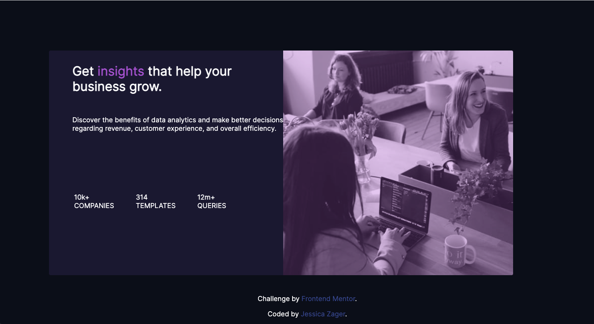

# Frontend Mentor - Stats preview card component solution

This is a solution to the [Stats preview card component challenge on Frontend Mentor](https://www.frontendmentor.io/challenges/stats-preview-card-component-8JqbgoU62). Frontend Mentor challenges help you improve your coding skills by building realistic projects. 

## Table of contents

- [Overview](#overview)
  - [The challenge](#the-challenge)
  - [Screenshot](#screenshot)
  - [Links](#links)
- [My process](#my-process)
  - [Built with](#built-with)
  - [What I learned](#what-i-learned)
  - [Continued development](#continued-development)
  - [Useful resources](#useful-resources)
- [Author](#author)
- [Acknowledgments](#acknowledgments)

## Overview
This is the 2nd Project selected by VMLYR's Code Challenge Group, selection made 4 March 2022.

### The challenge

Users should be able to:

- View the optimal layout depending on their device's screen size

### Screenshot - Desktop Solution

Add a screenshot of your solution. The easiest way to do this is to use Firefox to view your project, right-click the page and select "Take a Screenshot". You can choose either a full-height screenshot or a cropped one based on how long the page is. If it's very long, it might be best to crop it.

Then crop/optimize/edit your image however you like, add it to your project, and update the file path in the image above.

### Links

- Solution URL: [Solution on GitHub](https://github.com/jmzager0110/stats-preview-card-component-main)
- Live Site URL: [Check it on Code Pen](https://codepen.io/jmzager0110/pen/Exoapxd)

## My process

Start by obsessing at all hours because you forgot how much you love CSS & there are super cool & talented Devs in your group.

Obsess over each tiny detail, Googling each thing multiple times, until you realize that it's almost midnight and you can't remember what a footer is called.

### Built with

- Semantic HTML5 markup
- CSS custom properties
- Flexbox
- CSS Flexbox
- Mobile-first workflow <- TODO!

### What I learned

 - More about FlexBox, the box that flexes!
 - More ways to handle images, like Filter
 - Using specific tags/attributes for mobile responsiveness in addition to CSS:
   - Aspect-Ratio
   - Object-Fit
   - Media Queries

🎉🎉🎉

### Continued development

 - This challenge was perfect for me as I am learning about A11Y, learning about media queries is a great stepping stone.
 - As a bonus, I've been desperately wanting to learn Sass, a lot of solutions I've seen used both, which really helps cement the relationship.

### Useful resources

- [Coolors!](https://coolors.co/) - I absolutely love this super fast & easy color palette generator.
- [CSS Tricks | SelectMenu](https://css-tricks.com/the-selectmenu-element/) - This awesome post gave me an idea to add a menu for the user to select their viewing preference, Desktop, Mobile, Flexxx, Grid, Dark Mode, etc. Not yet implemented, but def want to try!
TODO! Add more resources!

## Author

- GitHub - [J Zager](https://github.com/jmzager0110)
- Frontend Mentor - [@jmzager0110](https://www.frontendmentor.io/profile/jmzager0110)

## Acknowledgments

VMLY&R CODE CHALLENGES GROUP!!! <3

